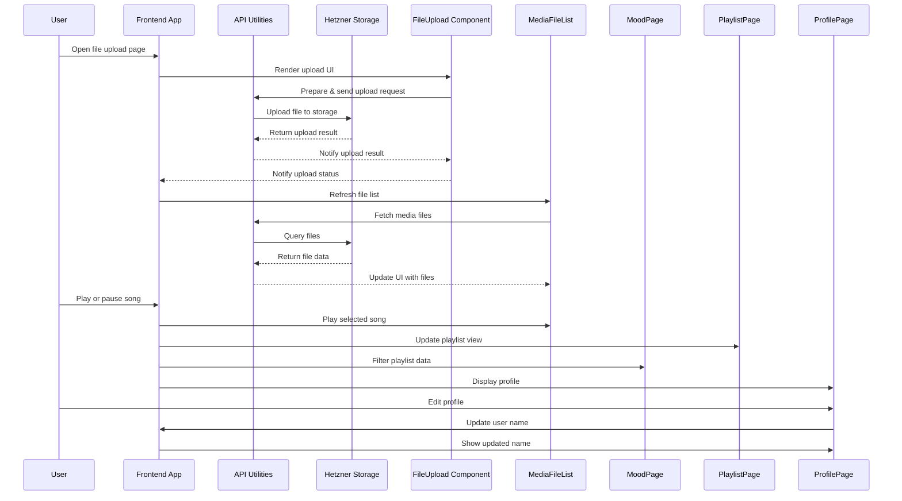

# Vibe Loop

A modern music streaming web app built with React (Vite, TypeScript, Tailwind CSS). Features file uploads, song listing, playback, playlists, and a clean, frontend-only architecture.

---

## 🗺️ App Flow Sequence Diagram

Below is a high-level sequence diagram showing the main user flows, frontend logic, API utilities, storage, and UI components.

---

## 🗂️ Project File Mapping

| Diagram Swimlane      | Project Files/Directories                                      | Description                                      |
|----------------------|---------------------------------------------------------------|--------------------------------------------------|
| **Frontend App**     | `src/pages/`, `src/components/`, `src/context/`, `src/store/` | Main React app, context, state, and UI           |
| **API Utilities**    | `src/lib/hetznerStorage.ts`, `src/hooks/useHetznerFiles.ts`   | Logic for file upload/listing, S3 integration    |
| **Hetzner Storage**  | (External)                                                     | S3 bucket, accessed via API utilities            |
| **FileUpload**       | `src/components/FileUpload.tsx`                                | File upload UI component                         |
| **MediaFileList**    | `src/components/MediaFileList.tsx`                             | Media file listing UI component                  |
| **MoodPage**         | `src/pages/MoodPage.tsx`                                       | Mood-based music selection page                  |
| **PlaylistPage**     | `src/pages/PlaylistPage.tsx`                                   | Playlist details and actions page                |
| **ProfilePage**      | `src/pages/ProfilePage.tsx`                                    | User profile page                               |

**Event System:**
- `src/lib/events.ts` — Used for emitting/listening to UI update events (e.g., after upload)

---

## 🔗 API Utilities & Endpoints Mapping

| **API Utility / Endpoint**         | **File(s)**                                         | **Used By / Purpose**                                                                                   |
|------------------------------------|-----------------------------------------------------|---------------------------------------------------------------------------------------------------------|
| **Hetzner S3 Upload**              | `src/lib/hetznerStorage.ts` `api/upload-to-hetzner.ts` | Handles file upload logic to Hetzner S3. Used by the `FileUpload` component to send files to storage.    |
| **List Hetzner Files**             | `src/hooks/useHetznerFiles.ts` `api/list-hetzner-files.ts` | Fetches the list of uploaded files from Hetzner S3. Used by `MediaFileList` and any page showing files.  |
| **Event System**                   | `src/lib/events.ts`                                 | Emits and listens for events (e.g., after upload, triggers file list refresh in UI components).          |
| **Supabase (legacy/disabled)**     | `src/hooks/useFileUpload.ts`                        | Previously handled uploads and metadata with Supabase. Now mostly disabled, but structure remains.       |
| **Upload and Store (Hetzner+Supabase)** | `api/upload-and-store.ts`                         | (If used) Uploads to Hetzner and stores metadata in Supabase.                                           |

### How the API Utilities Are Connected in the App Flow

1. **User uploads a file** via `FileUpload` (`src/components/FileUpload.tsx`)
2. **FileUpload** calls the upload API utility (`src/lib/hetznerStorage.ts` or `api/upload-to-hetzner.ts`)
3. **API utility** sends the file to Hetzner S3
4. On success, **FileUpload** emits an event via `src/lib/events.ts`
5. **MediaFileList** (`src/components/MediaFileList.tsx`) listens for this event and uses `src/hooks/useHetznerFiles.ts` to fetch the updated file list from `api/list-hetzner-files.ts`
6. **MediaFileList** displays the updated files

---

## 🚀 Features
- Upload and stream audio/video files
- Playlist and mood-based browsing
- Responsive, modern UI
- No backend required — all logic is frontend or serverless

---

## 🛠️ Setup
1. Install dependencies: `npm install`
2. Start the dev server: `npm run dev`

---

## 🤝 Contributing
Pull requests and issues welcome!
